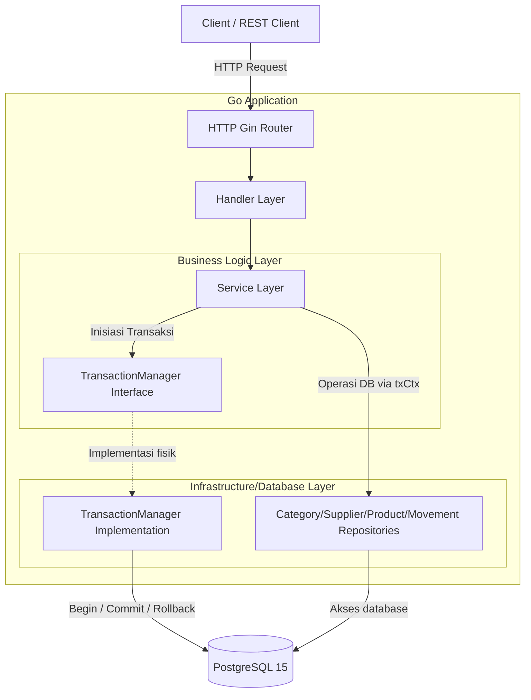

# Architecture: Inventory Management API

**Status:** `Implemented`
**Last updated:** 2026-06-29

---

## 1. Architectural style

Layanan ini mengadopsi gaya **Clean Architecture** dengan layer Handler -> Service -> Repository. 
Sebagai perluasan dari Project 1, proyek ini memperkenalkan **Transaction Manager Wrapper** berbasis Go Context untuk membolehkan orkestrasi beberapa langkah bisnis di dalam Service layer berjalan di bawah payung transaksi SQL atomis, tanpa membocorkan tipe data driver database relasional ke Service layer.

## 2. System diagram



## 3. Folder structure

```
05-project-inventory-management/
├── cmd/
│   └── server/
│       └── main.go         # Entrypoint server, setup DI, and route mappings
├── internal/
│   ├── config/
│   │   └── config.go       # Struct dan parsing variabel lingkungan
│   ├── entity/
│   │   ├── category.go     # Category domain model
│   │   ├── supplier.go     # Supplier domain model
│   │   ├── product.go      # Product domain model (dengan relasi)
│   │   └── movement.go     # StockMovement domain model
│   ├── handler/
│   │   ├── health.go       # Health check HTTP handler
│   │   ├── category.go     # Category API HTTP Handler
│   │   ├── supplier.go     # Supplier API HTTP Handler
│   │   ├── product.go      # Product API HTTP Handler & CSV export
│   │   ├── movement.go     # Stock Mutation API HTTP Handler
│   │   └── movement_test.go# Unit test untuk HTTP Handler mutasi
│   ├── repository/
│   │   ├── tx_manager.go   # Context-based Transaction Manager & helper
│   │   ├── category.go     # Category DB operations
│   │   ├── supplier.go     # Supplier DB operations
│   │   ├── product.go      # Product DB operations & row locking
│   │   └── movement.go     # StockMovement DB operations
│   └── service/
│       ├── category.go     # Category service logic
│       ├── supplier.go     # Supplier service logic
│       ├── product.go      # Product service logic & FK validations
│       ├── movement.go     # Transactional Stock In/Out business logic
│       └── movement_test.go# Unit test untuk Movement Service & Rollbacks
├── .env                    # Konfigurasi variabel lingkungan lokal (ignored)
├── .env.example            # Berkas contoh konfigurasi
├── docker-compose.yml      # DB PostgreSQL lokal
└── Dockerfile              # Dockerfile multi-stage
```

## 4. Component responsibilities

| Component | Responsibility | Does NOT do |
|---|---|---|
| **Handler** | Parsing payload HTTP JSON, mengurai parameter kueri paginasi (`page`, `limit`), streaming body CSV, mengembalikan HTTP status codes. | Melakukan kueri SQL, orkestrasi mutasi stok transaksional. |
| **Service** | Orkestrasi bisnis. Memvalidasi ketersediaan foreign key (CategoryID/SupplierID) pada produk, memulai transaksi database via `TransactionManager`, mengevaluasi kecukupan stok saat barang keluar. | Mengetahui detail objek database `*gorm.DB`, mem-parsing HTTP context. |
| **Repository** | Data access abstraction. Mengambil koneksi database dari context (`GetDBFromContext`) untuk dieksekusi secara transaksional atau non-transaksional. | Mengecek aturan kecukupan stok barang (aturan bisnis). |
| **Transaction Manager** | Menyediakan wrapper `WithTransaction(ctx, fn)` untuk membungkus callback kueri di dalam transaksi GORM. | Melakukan operasi kueri bisnis secara mandiri. |

## 5. Data flow — Stock Out Mutasi

Walkthrough alur request ketika pengguna memicu Stock Out (`POST /products/:id/stock-out`):

1. Request JSON kuantitas dan referensi tiba di `StockOut` handler di [handler/movement.go](file:///Users/timurdianradhasejati/Programming/Code/Golang/golang-backend-roadmap/05-project-inventory-management/internal/handler/movement.go).
2. Handler mengurai `product_id` dari path parameter dan payload kuantitas dari JSON body.
3. Handler memanggil `StockOut` pada `MovementService` dengan meneruskan context request.
4. Di [service/movement.go](file:///Users/timurdianradhasejati/Programming/Code/Golang/golang-backend-roadmap/05-project-inventory-management/internal/service/movement.go), service memicu transaksi:
   `s.txManager.WithTransaction(ctx, func(txCtx context.Context) error { ... })`
5. Di dalam callback transaksi (`txCtx`):
   - Service mengambil produk menggunakan repository `GetByIDForUpdate(txCtx, productID)` yang menambahkan klausul `SELECT ... FOR UPDATE` di PostgreSQL.
   - Service mencocokkan stok saat ini dengan jumlah barang keluar. Jika kurang, kembalikan `ErrInsufficientStock`.
   - Service memanggil repository `UpdateStock(txCtx, productID, -quantity)` untuk mengurangi stok produk di DB.
   - Service memanggil repository `movementRepo.Create(txCtx, movementLog)` untuk menulis log histori mutasi keluar (`OUT`).
6. Jika callback mengembalikan `nil` (tanpa error), Transaction Manager mengeksekusi **Commit** di PostgreSQL.
7. Jika callback mengembalikan error (misal stok kurang), Transaction Manager mengeksekusi **Rollback** sehingga perubahan stok produk dan log mutasi dibatalkan otomatis dari database.
8. Service mengembalikan hasil mutasi (atau error) ke Handler.
9. Handler memetakan status: Sukses menghasilkan **200 OK** beserta payload log, error stok kurang menghasilkan **400 Bad Request**.

## 6. Cross-cutting concerns

- **Transaction Context Propagation:** Token transaksi `*gorm.DB` disembunyikan di dalam Go Context menggunakan key privat `txKey{}`. Setiap pemanggilan kueri di repository mengambil koneksi tersebut secara implisit, menjaga kode service tetap portabel.
- **Error Handling:** Database database constraints (FK violation) dipetakan ke tingkat HTTP status (seperti 500/400). Error bisnis seperti `ErrInsufficientStock` dipetakan ke HTTP 400.

## 7. Dependencies on other projects in this repo

Proyek ini independen. Di masa depan, integrasi dengan **Auth Service (Project 7)** dapat diterapkan untuk mengamankan data mutasi gudang.

## 8. Known architectural limitations

- **Preloading Overhead:** Paginasi kueri produk menggunakan `Preload` GORM untuk memuat Category dan Supplier. Pada jutaan baris data, `Preload` melakukan kueri sekunder (`IN (?, ?, ...)`) yang bisa lambat. Solusi: Gunakan query `JOIN` SQL eksplisit di repository jika performa menurun.

---

## Changelog

| Date | Change |
|---|---|
| 2026-06-29 | Inisiasi arsitektur proyek Inventory Management API dengan Transaction Manager |
