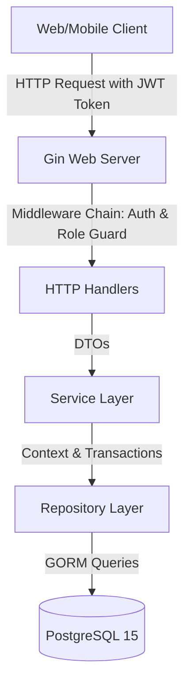

# Architecture: Booking Management System

---

## 1. High-level diagram (System Context)



## 2. Component breakdown

Proyek ini menerapkan pola arsitektur bersih (Clean Architecture) terbagi atas tiga lapisan inti:

### 1. Handler Layer (`internal/handler/`)
Menerima HTTP Request, mengikat (*binding*) data payload JSON, mengekstrak data user dari context yang disisipkan oleh middleware, memanggil Service layer, dan mengembalikan format respons JSON standar.
- [user.go](file:///Users/timurdianradhasejati/Programming/Code/Golang/golang-backend-roadmap/06-project-booking-system/internal/handler/user.go): Registrasi dan Login JWT.
- [desk.go](file:///Users/timurdianradhasejati/Programming/Code/Golang/golang-backend-roadmap/06-project-booking-system/internal/handler/desk.go): Pengelolaan data master meja/ruangan.
- [booking.go](file:///Users/timurdianradhasejati/Programming/Code/Golang/golang-backend-roadmap/06-project-booking-system/internal/handler/booking.go): Pembuatan, pembatalan, dan daftar booking.

### 2. Service Layer (`internal/service/`)
Mengatur logika bisnis utama, validasi input waktu UTC, penanganan enkripsi password (bcrypt), pemrosesan algoritma overlap ketersediaan slot waktu, dan pemanggilan callback transaksi database.
- [user.go](file:///Users/timurdianradhasejati/Programming/Code/Golang/golang-backend-roadmap/06-project-booking-system/internal/service/user.go): Verifikasi password hash dan pembuatan token JWT.
- [desk.go](file:///Users/timurdianradhasejati/Programming/Code/Golang/golang-backend-roadmap/06-project-booking-system/internal/service/desk.go): Validasi nama dan tipe aset.
- [booking.go](file:///Users/timurdianradhasejati/Programming/Code/Golang/golang-backend-roadmap/06-project-booking-system/internal/service/booking.go): Validasi rentang waktu, locking meja, pemeriksaan irisan waktu overlap, batasan pembatalan 2 jam, dan logging stdout stub.

### 3. Repository Layer (`internal/repository/`)
Mengabstraksi akses data ke database PostgreSQL menggunakan GORM.
- [tx_manager.go](file:///Users/timurdianradhasejati/Programming/Code/Golang/golang-backend-roadmap/06-project-booking-system/internal/repository/tx_manager.go): Mengontrol siklus transaksi SQL melalui context payload key `txKey`.
- [user.go](file:///Users/timurdianradhasejati/Programming/Code/Golang/golang-backend-roadmap/06-project-booking-system/internal/repository/user.go): Kueri data user.
- [desk.go](file:///Users/timurdianradhasejati/Programming/Code/Golang/golang-backend-roadmap/06-project-booking-system/internal/repository/desk.go): Kueri data meja, termasuk locking `FOR UPDATE` baris meja.
- [booking.go](file:///Users/timurdianradhasejati/Programming/Code/Golang/golang-backend-roadmap/06-project-booking-system/internal/repository/booking.go): Kueri log booking dan deteksi irisan waktu.

---

## 3. Data flow

Penciptaan booking baru terproteksi:

```mermaid
sequenceIndex
    Client ->> GinServer: POST /bookings (Bearer JWT Token)
    Note over GinServer: AuthMiddleware validates token
    GinServer ->> BookingHandler: Extract UserID from Gin Context
    BookingHandler ->> BookingService: CreateBooking(userID, deskID, start, end)
    Note over BookingService: Convert start/end to UTC
    BookingService ->> TransactionManager: WithTransaction(ctx, callback)
    TransactionManager ->> DB: BEGIN TRANSACTION
    BookingService ->> DeskRepository: GetByIDForUpdate(txCtx, deskID)
    DB -->> BookingService: Locked Desk Record (Pessimistic)
    BookingService ->> BookingRepository: GetOverlapBookings(txCtx, deskID, start, end)
    DB -->> BookingService: Overlap Bookings Count
    alt Overlap found
        BookingService ->> TransactionManager: Abort (Error ErrDoubleBooking)
        TransactionManager ->> DB: ROLLBACK
        BookingService -->> Client: 400 Bad Request
    else No overlap
        BookingService ->> BookingRepository: Create(booking)
        DB -->> BookingService: Success
        Note over BookingService: Print STUB Notification stdout log
        BookingService ->> TransactionManager: Commit
        TransactionManager ->> DB: COMMIT
        BookingService -->> Client: 201 Created (JSON Booking Details)
    end
```

## 4. Key architectural decisions

- **Context-Based Transaction Manager:** Menggunakan wrapper context GORM untuk mentransmisikan transaksi SQL database ke repositori secara transparan tanpa mengotori Service Layer dengan interface database (*decoupling*).
- **Pessimistic Row-Locking pada Desk:** Mengunci baris `Desk` terlebih dahulu menggunakan `FOR UPDATE` sebelum mengevaluasi query overlap. Hal ini membuat request pemesanan konkuren untuk meja yang sama diproses mengantri secara aman.
- **UTC Enforcement:** Input format waktu dikonversi ke UTC di Service layer sesegera mungkin sebelum validasi waktu dimulai dijalankan.

---

## Changelog

| Date | Change |
|---|---|
| 2026-06-29 | Inisiasi dokumen desain arsitektur dan diagram urutan transaksi Booking System |
