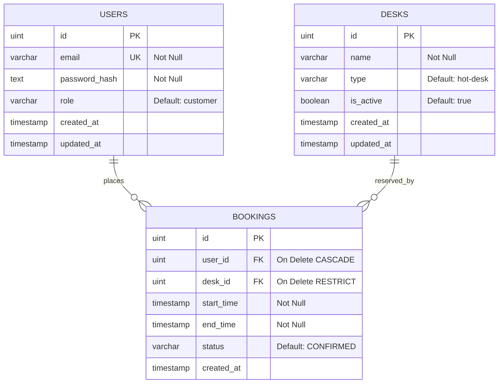

# Database Design: Booking Management System

---

## 1. Entity-Relationship Diagram (ERD)



## 2. Table schemas

### 1. `users`
Tabel untuk menyimpan kredensial pengguna terenkripsi dan role hak akses.
- **Constraints:**
  - `email`: `UNIQUE` index untuk mencegah pendaftaran ganda.

### 2. `desks`
Tabel master data untuk aset meja kerja atau ruang rapat yang disewakan.
- **Constraints:**
  - `name`: `NOT NULL` untuk identifikasi aset fisik.

### 3. `bookings`
Tabel transaksi pemesanan slot meja kerja berdasarkan rentang waktu.
- **Constraints:**
  - `user_id`: Foreign key ke `users.id` dengan opsi `ON DELETE CASCADE` (jika user dihapus, data booking ikut bersih).
  - `desk_id`: Foreign key ke `desks.id` dengan opsi `ON DELETE RESTRICT` (meja tidak boleh dihapus dari database jika masih ada riwayat booking aktif).
  - `start_time` dan `end_time` disimpan dalam format **timestamp without time zone** UTC secara konsisten.

---

## 3. Database Indexes

Kami merekomendasikan penambahan indeks khusus pada tabel `bookings` untuk mempercepat pencarian data overlap yang sering dipanggil:

```sql
CREATE INDEX idx_bookings_overlap ON bookings (desk_id, status, start_time, end_time);
```

**Justifikasi Indeks:**
Kueri pencarian overlap memfilter baris berdasarkan parameter `desk_id`, status `CONFIRMED`, kemudian membandingkan rentang `start_time` dan `end_time`. Indeks komposit di atas menjamin kueri overlap diselesaikan menggunakan index scan yang sangat efisien dibanding table scan penuh.

---

## Changelog

| Date | Change |
|---|---|
| 2026-06-29 | Inisiasi desain ERD dan indeks komposit deteksi overlap |
