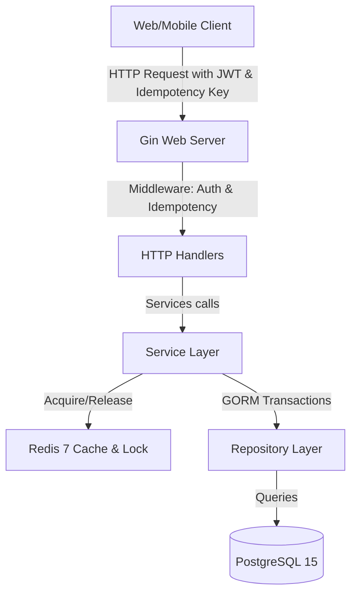

# Architecture: Digital Wallet API

---

## 1. High-level diagram (System Context)



## 2. Component breakdown

### 1. Handler Layer (`internal/handler/`)
Menerima HTTP Request, mem-binding JSON request body, mengekstrak userID dari context token JWT, memanggil Service layer, dan mengembalikan format JSON response.
- [user.go](file:///Users/timurdianradhasejati/Programming/Code/Golang/golang-backend-roadmap/07-project-digital-wallet/internal/handler/user.go): Registrasi dan Login JWT.
- [wallet.go](file:///Users/timurdianradhasejati/Programming/Code/Golang/golang-backend-roadmap/07-project-digital-wallet/internal/handler/wallet.go): API Balance, Top-up, Withdraw, Transfer, dan daftar transaksi mutasi ledger.

### 2. Service Layer (`internal/service/`)
Mengatur logika bisnis utama, enkripsi password, distributed lock acquisition, invalidasi cache, dan penjaminan debit/kredit seimbang di bawah transaksi database relasional.
- [user.go](file:///Users/timurdianradhasejati/Programming/Code/Golang/golang-backend-roadmap/07-project-digital-wallet/internal/service/user.go): Membuat User sekaligus Wallet baru dalam transaksi database relasional atomic.
- [wallet.go](file:///Users/timurdianradhasejati/Programming/Code/Golang/golang-backend-roadmap/07-project-digital-wallet/internal/service/wallet.go): Cek balance dengan cache-aside pattern, distributed lock urutan ID terkecil, mutasi ledger topup/withdraw/transfer, dan cache invalidation.

### 3. Repository Layer (`internal/repository/`)
Mengabstraksi database query PostgreSQL.
- [tx_manager.go](file:///Users/timurdianradhasejati/Programming/Code/Golang/golang-backend-roadmap/07-project-digital-wallet/internal/repository/tx_manager.go): Mengelola context-based database transactions.
- [user.go](file:///Users/timurdianradhasejati/Programming/Code/Golang/golang-backend-roadmap/07-project-digital-wallet/internal/repository/user.go), [wallet.go](file:///Users/timurdianradhasejati/Programming/Code/Golang/golang-backend-roadmap/07-project-digital-wallet/internal/repository/wallet.go), [transaction.go](file:///Users/timurdianradhasejati/Programming/Code/Golang/golang-backend-roadmap/07-project-digital-wallet/internal/repository/transaction.go): Implementasi kueri GORM.

---

## 3. Data flow

Pencegahan double-spending transaksional konkuren:

```mermaid
sequenceIndex
    Client ->> GinServer: POST /wallet/transfer (Sender & Receiver details)
    Note over GinServer: IdempotencyMiddleware checks key in Redis
    alt Idempotency HIT
        GinServer -->> Client: Return cached response
    else Idempotency MISS
        GinServer ->> WalletHandler: Process Transfer
        WalletHandler ->> WalletService: Transfer(senderID, destNumber, amount)
        Note over WalletService: Determine lock order: lock ID 1 then ID 2
        WalletService ->> Redis: AcquireLock(lock:wallet:1)
        Redis -->> WalletService: Lock acquired (token1)
        WalletService ->> Redis: AcquireLock(lock:wallet:2)
        Redis -->> WalletService: Lock acquired (token2)
        
        WalletService ->> TransactionManager: WithTransaction(ctx, callback)
        TransactionManager ->> DB: BEGIN TRANSACTION
        WalletService ->> WalletRepository: Get updated balance details
        Note over WalletService: Validate balance sufficiency
        WalletService ->> WalletRepository: Deduct sender balance, add receiver balance
        WalletService ->> TransactionRepository: Log Debit/Credit Transaction Ledger
        TransactionManager ->> DB: COMMIT
        
        WalletService ->> Redis: Invalidate cached balances
        WalletService ->> Redis: ReleaseLock(lock:wallet:1, token1)
        WalletService ->> Redis: ReleaseLock(lock:wallet:2, token2)
        
        Note over GinServer: Cache response body in Redis (TTL 1 hour)
        WalletHandler -->> Client: 200 OK (Transaction details)
    end
```

## 4. Key architectural decisions

- **Deadlock-Free Lock Ordering:** Sebelum mengunci distributed lock untuk dua wallet yang berbeda, ID wallet diurutkan terlebih dahulu. Kita selalu mengunci ID terkecil sebelum ID terbesar. Hal ini menjamin tidak terjadi *deadlock* di mana Utas A mengunci Wallet 1 dan menunggu Wallet 2, sedangkan Utas B mengunci Wallet 2 dan menunggu Wallet 1 secara bersamaan.
- **Cache-Aside Pattern:** Kueri saldo membaca cache Redis terlebih dahulu. Jika kosong, ia membaca dari DB PostgreSQL, menulis data ke cache, dan mengembalikan respons. Untuk menjamin konsistensi, cache saldo langsung dihapus (*invalidated*) setiap kali mutasi transaksi baru sukses disimpan ke database.

---

## Changelog

| Date | Change |
|---|---|
| 2026-06-29 | Inisiasi dokumen arsitektur dan diagram integrasi Redis Lock & Idempotency |
