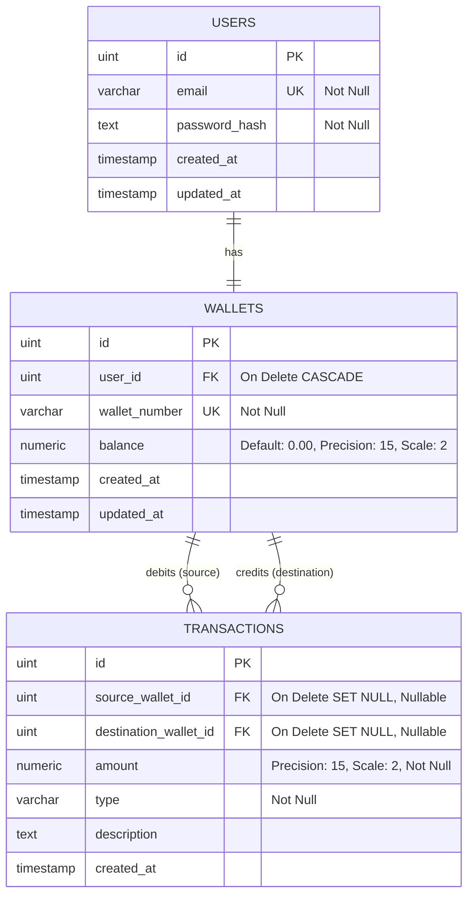

# Database Design: Digital Wallet API

---

## 1. Entity-Relationship Diagram (ERD)



## 2. Table schemas

### 1. `users`
Kredensial dasar pengguna.

### 2. `wallets`
Menyimpan saldo berjalan (*running balance*) dan nomor akun unik dompet digital.
- **Constraints:**
  - `wallet_number`: `UNIQUE` index untuk melayani transfer saldo.
  - `balance`: Menggunakan tipe data **numeric(15,2)** di PostgreSQL (dipetakan ke `float64` di Go) untuk menghindari masalah akurasi pembulatan float biner pada perhitungan finansial.

### 3. `transactions`
Tabel ledger pencatatan debit/kredit seimbang.
- **Constraints:**
  - `source_wallet_id`: NULL pada transaksi Top-up.
  - `destination_wallet_id`: NULL pada transaksi Withdrawal.
  - Keduanya terisi jika tipe transaksi `transfer`.
  - Hubungan foreign key ke `wallets.id` dikonfigurasikan dengan `ON DELETE SET NULL` agar data audit log transaksi historis tetap tersimpan meskipun akun wallet pengguna dihapus di masa depan.

---

## 3. Database Indexes

Untuk mempercepat kueri baca histori mutasi ledger berdasarkan ID wallet:

```sql
CREATE INDEX idx_transactions_wallets ON transactions (source_wallet_id, destination_wallet_id);
```

**Justifikasi Indeks:**
API riwayat mutasi memfilter baris berdasarkan parameter `source_wallet_id = ? OR destination_wallet_id = ?`. Indeks ini menjamin kueri pencarian multi-kolom diselesaikan secara cepat.

---

## Changelog

| Date | Change |
|---|---|
| 2026-06-29 | Inisiasi ERD skema finansial numeric precision dan indeks audit ledger |
