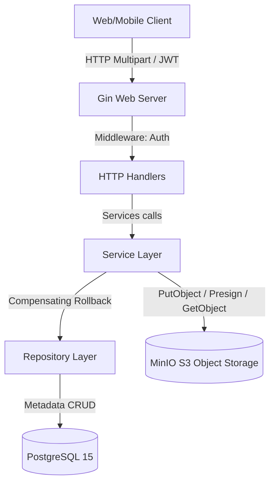

# Architecture: File Management Service

---

## 1. High-level diagram (System Context)



## 2. Component breakdown

### 1. Handler Layer (`internal/handler/`)
Mengatur HTTP request, form multipart file parsing, otentikasi JWT claims, dan penyajian data stream ke client.
- [user.go](file:///Users/timurdianradhasejati/Programming/Code/Golang/golang-backend-roadmap/08-project-file-management/internal/handler/user.go): Registrasi dan login JWT.
- [file.go](file:///Users/timurdianradhasejati/Programming/Code/Golang/golang-backend-roadmap/08-project-file-management/internal/handler/file.go): Upload file stream, get list file terdaftar, view file stream, download presigned URL generator, dan hapus berkas.

### 2. Service Layer (`internal/service/`)
Mengimplementasikan business logic utama:
- [file.go](file:///Users/timurdianradhasejati/Programming/Code/Golang/golang-backend-roadmap/08-project-file-management/internal/service/file.go): Validasi tipe file (JPEG, PNG, PDF) dan batasan size (maksimal 10MB).
- **Compensating Rollback:** Mengatur urutan penulisan DB metadata (status `PENDING`), melempar berkas ke MinIO, memperbarui status menjadi `SUCCESS` jika berhasil, atau menghapus metadata di PostgreSQL jika PutObject gagal.

### 3. Repository Layer (`internal/repository/`)
Mengabstraksi query PostgreSQL.
- [user.go](file:///Users/timurdianradhasejati/Programming/Code/Golang/golang-backend-roadmap/08-project-file-management/internal/repository/user.go): Kueri data pengguna.
- [file.go](file:///Users/timurdianradhasejati/Programming/Code/Golang/golang-backend-roadmap/08-project-file-management/internal/repository/file.go): Kueri database relasional CRUD metadata berkas.

---

## 3. Data flow

### Alur Proses Unggah Berkas (Multipart Upload)

```mermaid
sequenceIndex
    Client ->> GinServer: POST /files/upload (multipart form-data file)
    Note over GinServer: AuthMiddleware extracts userID
    GinServer ->> FileHandler: Upload(c)
    FileHandler ->> FileHandler: Open file stream (fileHeader.Open)
    FileHandler ->> FileService: Upload(userID, filename, size, contentType, stream)
    Note over FileService: Validate size < 10MB & allowed MIME types
    FileService ->> FileRepository: Create metadata (status = 'PENDING')
    FileRepository ->> DB: INSERT INTO files (status = 'PENDING')
    
    FileService ->> Minio: PutObject(bucket, objectKey, stream, size)
    alt Minio Upload SUCCESS
        FileService ->> FileRepository: Update metadata (status = 'SUCCESS')
        FileRepository ->> DB: UPDATE files SET status = 'SUCCESS'
        FileService -->> FileHandler: Return File metadata object
        FileHandler -->> Client: 201 Created (JSON File metadata)
    else Minio Upload FAILED
        FileService ->> FileRepository: Delete metadata (Compensating write)
        FileRepository ->> DB: DELETE FROM files WHERE id = ?
        FileService -->> FileHandler: Return upload error
        FileHandler -->> Client: 500 Internal Server Error
    end
```

---

## 4. Key architectural decisions

- **Direct Memory Multipart Piping:** Saat file diunggah via multipart form-data, Gin tidak menyimpan file ke disk server (no local caching). Kita langsung mengambil file stream reader dari body multipart HTTP, lalu mem-pipe stream tersebut langsung ke SDK PutObject. Hal ini membuat server backend Go bersifat stateless dan efisien RAM.
- **Compensating Writes:** Karena database relasional (PostgreSQL) dan Object Storage (MinIO) tidak tergabung dalam satu kesatuan sistem transaksi ACID (no distributed transaction coordinator), kami menggunakan pendekatan *compensating write* di service layer untuk menjamin jika upload MinIO gagal, baris metadata `PENDING` di PostgreSQL dihapus kembali.

---

## Changelog

| Date | Change |
|---|---|
| 2026-06-29 | Inisiasi dokumen arsitektur dan dataflow pipeline compensating rollback |
