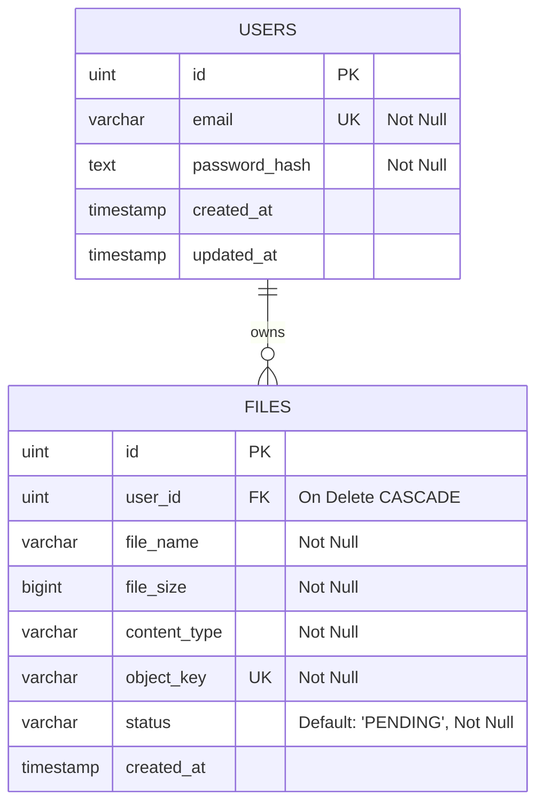

# Database Design: File Management Service

---

## 1. Entity-Relationship Diagram (ERD)



## 2. Table schemas

### 1. `users`
Tabel dasar data autentikasi pengguna.

### 2. `files`
Menyimpan metadata berkas yang berhasil diunggah ke Object Storage.
- **Constraints:**
  - `user_id`: Foreign key ke `users.id` dengan konfigurasi `ON DELETE CASCADE`. Jika akun pengguna dihapus, metadatanya di database relasional ikut terhapus.
  - `object_key`: `UNIQUE` index untuk memastikan tidak ada path objek ganda di MinIO.
  - `status`: Menyimpan status siklus upload (`PENDING` atau `SUCCESS`). Kueri listing file (`GET /files`) hanya memuat baris dengan status `SUCCESS` agar berkas yang gagal upload tidak bocor ke user.

---

## 3. Database Indexes

Meningkatkan efisiensi pemanggilan list file per user:

```sql
CREATE INDEX idx_files_user_status ON files (user_id, status);
```

**Justifikasi Indeks:**
Klien memfilter baris berdasarkan parameter `user_id = ? AND status = 'SUCCESS'`. Indeks komposit ini mempercepat kueri baca riwayat file secara drastis saat jumlah berkas di sistem membengkak.

---

## Changelog

| Date | Change |
|---|---|
| 2026-06-29 | Inisiasi ERD skema metadata berkas dan indeks komposit |
