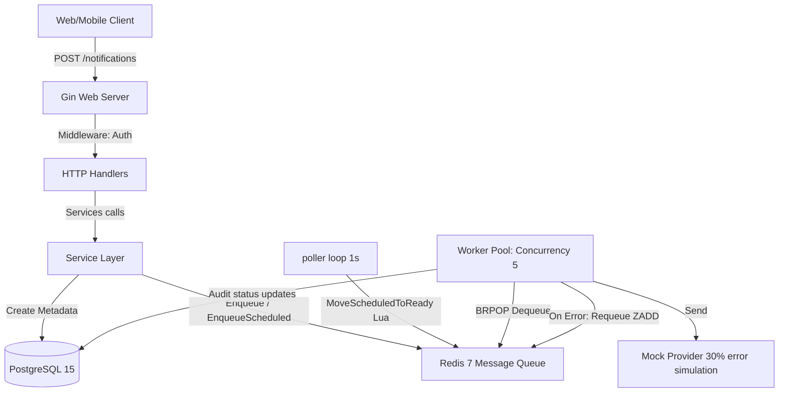

# Architecture: Notification Service

---

## 1. High-level diagram (System Context)



## 2. Component breakdown

### 1. Handler Layer (`internal/handler/`)
Menyediakan REST endpoint dan parsing input request body.
- [user.go](file:///Users/timurdianradhasejati/Programming/Code/Golang/golang-backend-roadmap/09-project-notification-service/internal/handler/user.go): Registrasi dan Login JWT ad-hoc.
- [notification.go](file:///Users/timurdianradhasejati/Programming/Code/Golang/golang-backend-roadmap/09-project-notification-service/internal/handler/notification.go): Menerima request kirim notifikasi instan atau terjadwal. Mengembalikan HTTP `202 Accepted` setelah data ter-push ke Redis.

### 2. Service Layer (`internal/service/`)
Mengelola business logic validasi format target dan update status audit.
- [notification.go](file:///Users/timurdianradhasejati/Programming/Code/Golang/golang-backend-roadmap/09-project-notification-service/internal/service/notification.go): Merekam status metadata `PENDING` di DB relasional, menghitung time trigger, dan mengoperasikan queue manager.

### 3. Queue Manager (`internal/queue/`)
Abstraksi data antrean di memory.
- [manager.go](file:///Users/timurdianradhasejati/Programming/Code/Golang/golang-backend-roadmap/09-project-notification-service/internal/queue/manager.go): LPUSH/BRPOP, ZADD, dan atomic Lua script.

### 4. Background Workers (`internal/worker/`)
Layanan background daemons berjalan mandiri di luar HTTP.
- [pool.go](file:///Users/timurdianradhasejati/Programming/Code/Golang/golang-backend-roadmap/09-project-notification-service/internal/worker/pool.go): Parallel workers pool mengeksekusi blocking pop tasks, menguji status DB, mengirim pesan, dan menghitung backoff retry jika error.
- [poller.go](file:///Users/timurdianradhasejati/Programming/Code/Golang/golang-backend-roadmap/09-project-notification-service/internal/worker/poller.go): Poller scheduler jatuh tempo setiap 1 detik.

---

## 3. Data flow

### Pipeline Pengiriman & Retry Exponential Backoff

```mermaid
sequenceIndex
    Client ->> GinServer: POST /notifications (email payload)
    GinServer ->> NotificationHandler: Create(c)
    NotificationHandler ->> NotificationService: Create(notifType, target, content, sendAt)
    NotificationService ->> NotificationRepository: Insert metadata (status = 'PENDING')
    NotificationService ->> QueueManager: Enqueue(task)
    QueueManager ->> Redis: LPUSH queue:notifications
    NotificationHandler -->> Client: 202 Accepted (instantly)
    
    Note over WorkerPool: Worker 1 calls BRPOP queue:notifications (blocking)
    Redis -->> WorkerPool: Dequeue task
    WorkerPool ->> NotificationService: Update status -> 'PROCESSING'
    WorkerPool ->> MockProvider: Send(type, target, content)
    alt Send FAILED
        Note over WorkerPool: Calculate backoff delay = (2^attempt) * 2 seconds
        WorkerPool ->> NotificationService: Update status -> 'PENDING' with log error
        WorkerPool ->> QueueManager: EnqueueScheduled(task, sendAt)
        QueueManager ->> Redis: ZADD queue:scheduled (score = timestamp)
    else Send SUCCESS
        WorkerPool ->> NotificationService: Update status -> 'SENT'
    end
```

---

## 4. Key architectural decisions

- **Atomic Lua Scheduler:** ZSET pemantauan scheduled task dipromosikan ke list utama melalui Lua script. Karena script Lua dieksekusi secara atomic *single-threaded* di dalam Redis engine, ini menjamin tidak terjadi balapan kondisi (*race conditions*) saat dipanggil oleh multi-node server.
- **Graceful Shutdown Integration:** Server menangani signal shutdown OS (SIGINT/SIGTERM). Context global dibatalkan agar loop worker dan poller berhenti membaca antrean baru, lalu http server ditutup dengan tenggat 5 detik untuk menyelesaikan pemrosesan transaksi yang tersisa.

---

## Changelog

| Date | Change |
|---|---|
| 2026-06-29 | Inisiasi dokumen arsitektur asinkron worker pool dan scheduler |
