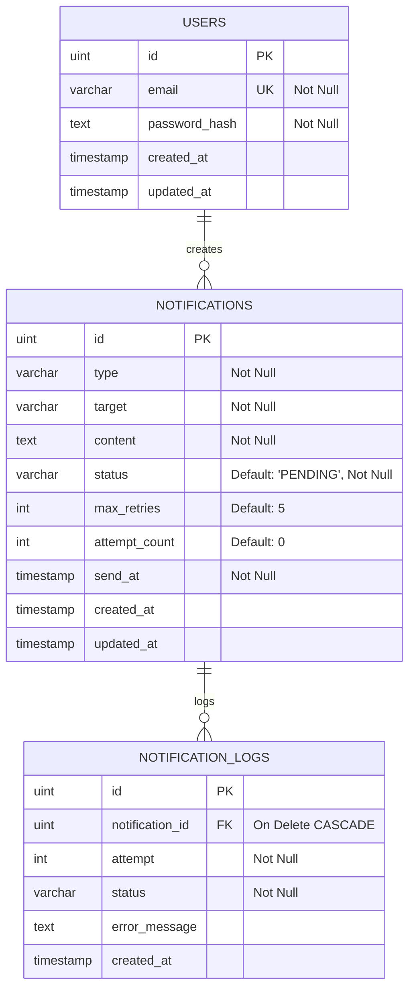

# Database Design: Notification Service

---

## 1. Entity-Relationship Diagram (ERD)



## 2. Table schemas

### 1. `notifications`
Tabel utama pencatatan metadata notifikasi.
- **Constraints:**
  - `status`: Berisi `PENDING`, `PROCESSING`, `SENT`, atau `FAILED`.
  - `send_at`: Tipe data timestamp UTC untuk merekam waktu eksekusi.

### 2. `notification_logs`
Tabel audit log terperinci untuk merekam setiap percobaan pengiriman asinkron.
- **Constraints:**
  - `notification_id`: Foreign key ke `notifications.id` dengan konfigurasi `ON DELETE CASCADE`. Jika record notifikasi dihapus, data audit logs otomatis dibersihkan.

---

## 3. Database Indexes

Untuk mempercepat kueri pengecekan status notifikasi:

```sql
CREATE INDEX idx_notifications_status ON notifications (status);
```

**Justifikasi Indeks:**
Meskipun audit logs bertambah besar seiring waktu, status notifikasi yang aktif (terutama `PENDING` atau `PROCESSING`) selalu dapat dicari dengan cepat melalui indeks status tunggal ini.

---

## Changelog

| Date | Change |
|---|---|
| 2026-06-29 | Inisiasi ERD skema audit trail notifikasi dan status indexes |
