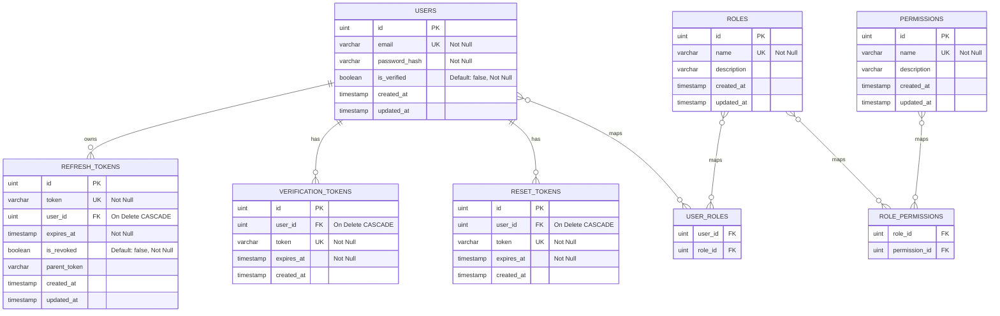

# Database Design: Authentication Service

---

## 1. Entity-Relationship Diagram (ERD)



## 2. Join Tables Many-to-Many

1. **`user_roles`**: Menghubungkan user ke role. Setiap user diasumsikan memiliki minimal satu role (default: `customer`).
2. **`role_permissions`**: Menghubungkan role ke izin permission secara granular (contoh: `admin` memiliki `wallet:read`, `wallet:write`, sedangkan `customer` hanya memiliki `wallet:read`).

---

## 3. Database Indexes

Untuk memitigasi brute-force attack dan mempercepat validasi token:

```sql
CREATE UNIQUE INDEX idx_users_email ON users (email);
CREATE UNIQUE INDEX idx_refresh_tokens_token ON refresh_tokens (token);
CREATE INDEX idx_refresh_tokens_user_id ON refresh_tokens (user_id);
```

**Justifikasi Indeks:**
Pengecekan eksistensi refresh token (`RotateRefreshToken`) dan kueri login (`GetUserByEmail`) wajib didukung indeks unik untuk menekan latensi kueri di bawah 1ms.

---

## Changelog

| Date | Change |
|---|---|
| 2026-06-29 | Inisiasi ERD skema relasional dynamic RBAC dan session token indexes |
