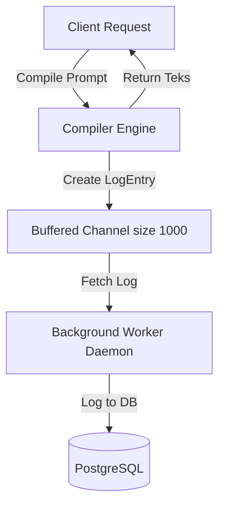

# Architecture: AI Prompt Management API

---

## 1. Authentication Dualism (Dashboard vs Server-to-Server Client)

Sistem ini menerapkan dua metode otentikasi terpisah berdasarkan jenis klien yang memanggil API:

### A. Dashboard Admin (JWT RS256 Offline Verifier)
- Digunakan oleh Prompt Engineer / Developer untuk mengelola workspaces dan prompts.
- Mengirimkan token JWT hasil login dari **Auth Service (Project 7)**.
- Validasi dilakukan secara **offline** di middleware local menggunakan `certs/public.key`.

```mermaid
sequenceIndex
    Developer ->> Prompt_Service: POST /api/v1/prompts (Authorization: Bearer <JWT>)
    Note over Prompt_Service: Middleware loads public.key
    Prompt_Service ->> Prompt_Service: Validate RS256 signature locally
    Prompt_Service ->> PostgreSQL: Query Create/Update Prompt
    Prompt_Service -->> Developer: 201 Created
```

### B. Downstream Client (API Key Redis Caching)
- Digunakan oleh Server-to-Server / Microservices platform untuk mengambil prompt terkompilasi.
- Mengirimkan API Key format `prompt_live_...` pada request header.
- Otentikasi divalidasi lewat Redis cache lookup (SHA-256 hash) untuk menekan overhead.

```mermaid
sequenceIndex
    Client_Service ->> Prompt_Service: POST /api/v1/client/prompts/1/compile (API Key)
    Prompt_Service ->> Prompt_Service: SHA-256 Hash raw API Key
    Prompt_Service ->> Redis: GET apikey:<hash>
    alt Cache Hit
        Redis -->> Prompt_Service: Return Workspace ID (latensi < 2ms)
    else Cache Miss
        Prompt_Service ->> PostgreSQL: Query ApiKey by KeyHash
        PostgreSQL -->> Prompt_Service: ApiKey Record (WorkspaceID)
        Prompt_Service ->> Redis: Set apikey:<hash> (TTL 1h)
    end
    Prompt_Service ->> Prompt_Service: Regex Compile template
    Prompt_Service ->> Analytics_Service: Log async via buffered channel
    Prompt_Service -->> Client_Service: 200 OK Compiled Prompt Text
```

---

## 2. Async Analytics Logging Architecture

Untuk mencegah logging database menghalangi respons compiler prompt ke downstream service:



- **Keunggulan:** Latensi penulisan ke DB terisolasi di background Goroutine. Jika database PostgreSQL mengalami lonjakan beban, response time kompilasi prompt tetap tidak terpengaruh.
