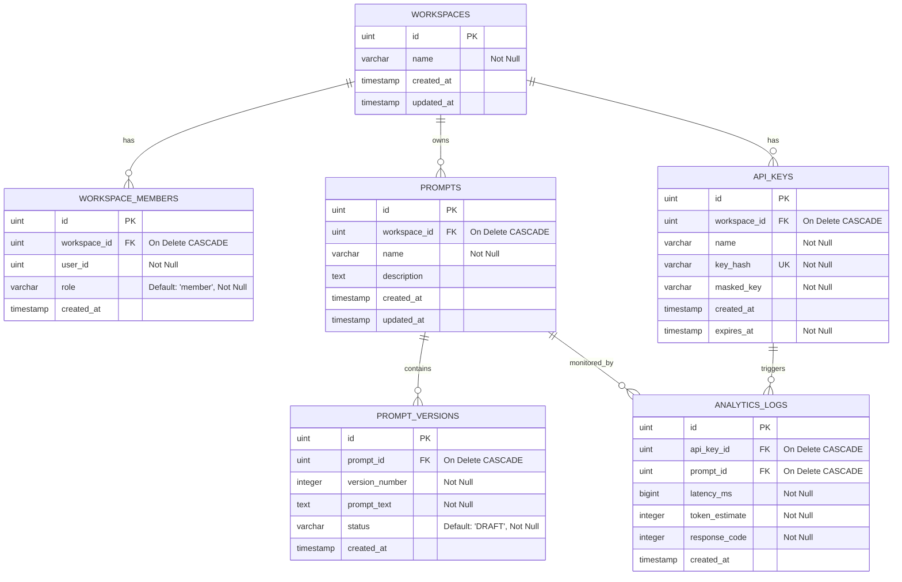

# Database Design: AI Prompt Management API

---

## 1. Entity-Relationship Diagram (ERD)



## 2. Database Indexes

Untuk memitigasi brute-force attack dan mempercepat validasi token:

```sql
CREATE UNIQUE INDEX idx_api_keys_key_hash ON api_keys (key_hash);
CREATE INDEX idx_prompt_versions_prompt_id ON prompt_versions (prompt_id);
CREATE INDEX idx_analytics_logs_prompt_id ON analytics_logs (prompt_id);
```

**Justifikasi Indeks:**
- `key_hash` dilindungi indeks unik untuk meminimalisasi overhead query DB saat Redis cache mengalami miss.
- `prompt_versions` didukung indeks pada `prompt_id` untuk mempercepat query baca snapshot versi aktif (`status = 'ACTIVE'`).
